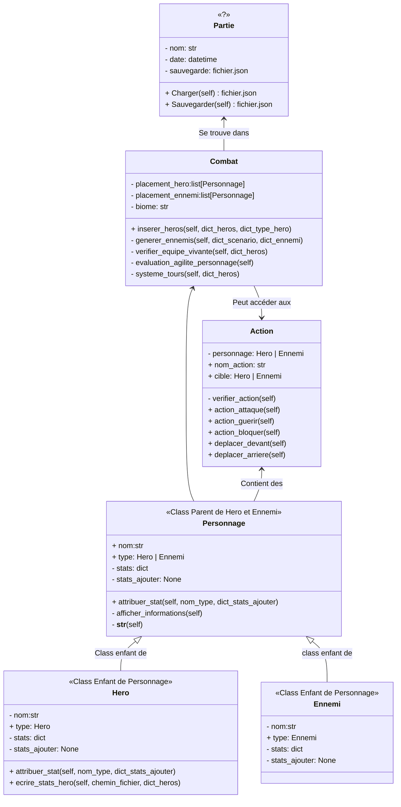
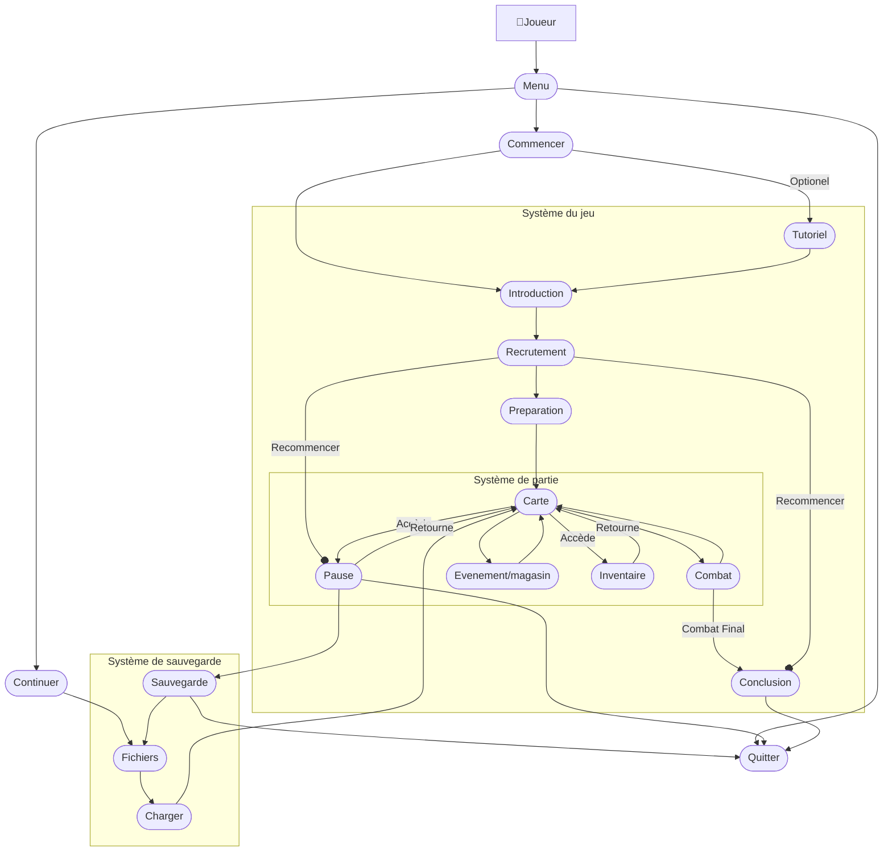
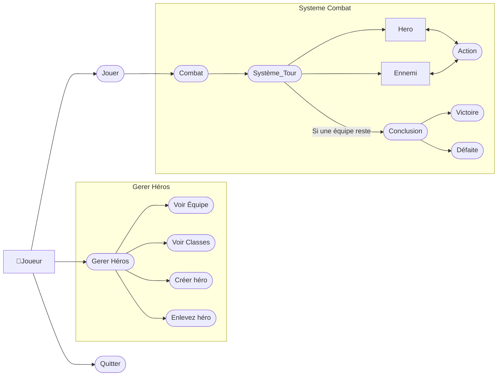

[](https://classroom.github.com/a/XtBEFomB)
# Projet de session

## Présentation
### Description du projet
Décrire le projet en environ 1 paragraphe. Quel est votre sujet ? Quelles sont les fonctionnalités principales ?
```
    Jeu Roguelike tour par tour
Nous allons créer un jeu tour par tour de type "rogue-like" (exploration dans un donjon pour gagner des récompenses).
Avant l'adventure, le joueur doit choisir 3 aventuriers parmi une liste d'aventuriers.Ils ont chacun des spécialisations
qui leurs attribue des avantages et des désavantages. Pour le moment on à penser à trois types: guerrier, chasseur et 
support. Ces héros ont aussi avec eux des équipements et des armes qui peuvent être changer lors de l'aventure.
Lors de l'exploration, le groupe tombe sur des combats et des événements, le dernier combat est un ennemi majeur(boss).

V Notes pour Sovannthanant et Luke. V
    Notes de méchanismes du jeu:
- 4-6 combats par partie, dernier est l'ennemi majeur(chef/boss).
- 0-2 évenements apres combat (marchand, malues, bonus, etc...)
- Biomes différents (Après chaque partie ou quelques combats?)
- Emplacement des personnages (devant, millieu, arrière)

    Notes sur les stats (dans la Class Personnages)
Stats essentiel:
- degat_melee
- degat_distance
- point_vie
- agilite (esquive et tour)
- chance (critique et contre-esquive)
```

### Membres de l'équipe et division des tâches
```
Inscrire le nom des membres de l'équipe et les tâches qui leurs sont assignées.

    Vann Sovannthanant
Classes : Personnage, Ennemi, Actions, Combat
Interface graphique : Creation_Personnage,
Tests : test_Personnage, test_Hero, test_Combat, test_action

    Luke Immanuel Legaspina
Classes : Hero, Combat, Actions
Interface graphique : Combat,
Tests : test_Ennemi, test_combat, test_action
```

## Conception
### Diagramme de classes


### Diagramme de cas d'utilisation
### Le plan Initiale

### Le plan Final


## Avancement et vérification des exigences
Vous pouvez ajouter des numéros de billets et ajouter des éléments. L'objectif est de vous aider à faire la gestion de votre projet.

### Documentation et organisation du code
- [x] Documentation de la personne responsable de chaque fichier
- [x] Documentation du code
- [x] Remise des diagrammes dans le projet
- [x] Organisation du code à l'aide d'au moins 2 _packages_

### Orienté-objet
- [x] Diagramme de classes
- [x] Au moins 4 classes qui entrent en relation (3 si vous êtes seul)
- [x] Au moins 3 propriétés par classe
- [x] Utilisation de l’héritage
- [x] Utilisation des accesseurs et des mutateurs
- [x] Utilisation d’au moins une exception personnalisée par personne

### Logique applicative
- [x] Diagramme de cas d'utilisation
- [x] Créer, modifier et supprimer différents objets
- [x] Afficher des objets selon leur relation avec d’autres objets 
- [x] Manipuler des dates
- [x] Valider adéquatement les données
- [x] Enregistrer les données
- [x] Charger les données au lancement de l’application

### Interface graphique
- [ ] Planification/ébauche
- [x] La taille relative des éléments est logique
- [x] Alignement adéquat des éléments graphiques
- [x] Messages d’erreurs situés près des erreurs
- [x] Confirmation des actions destructrices

### Contrôle de qualité
- [x] Tests unitaires
- [x] Appliquer les recommandations suite à la remise formative du 24 avril
- [x] Appliquer les recommandations suite à la rétroaction par les pairs
